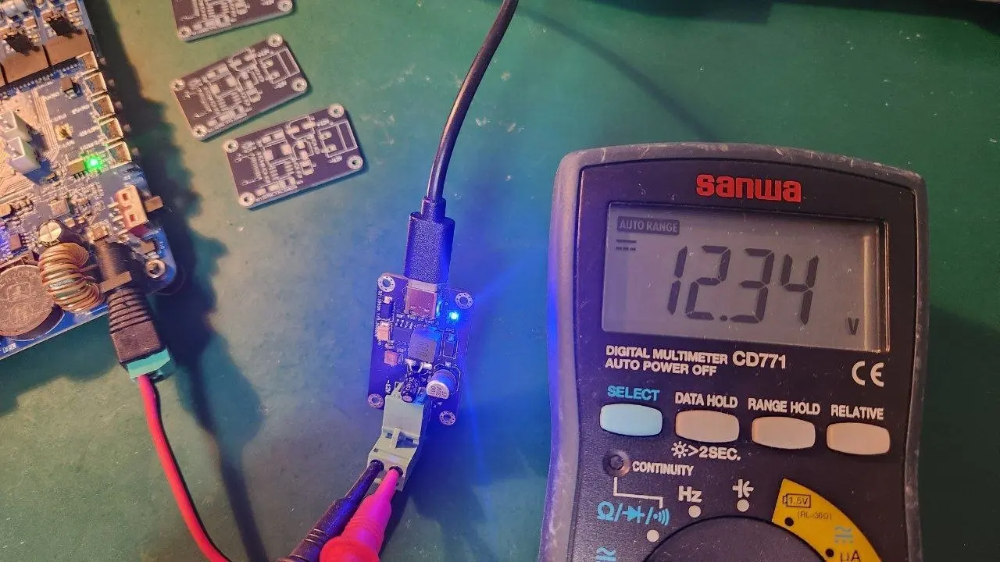

# USB 5V to 12V Boost Converter

This repository contains a simple USB-powered boost converter board that converts a 5V input into a 12V output using an MC34063 switching regulator. The design is intended for low-power applications that need a cheap and compact 12V supply.

## Features

- USB-C input connector
- Boost converter based on the MC34063
- 12V output for external loads
- KiCad project files for schematic, PCB layout, and manufacturing output
- BOM and positional files included for assembly

Although the efficiency is not especially high, the circuit remains inexpensive and practical for simple projects, small peripherals, and other low-power loads.

## Notes

- This board is best suited for low-power applications.
- The converter efficiency is around 85%, so power loss and heat should be considered for higher-current loads.
- Always verify polarity and wiring before powering the circuit.
